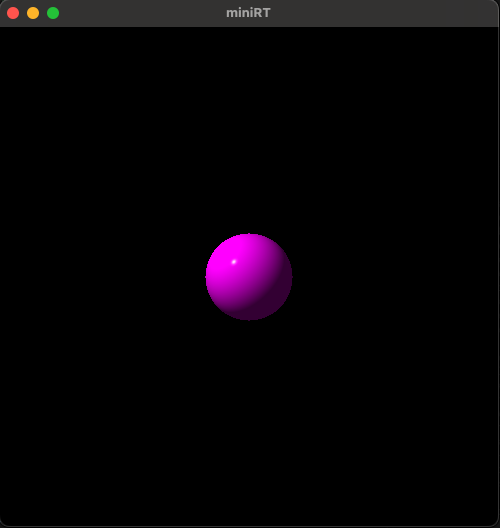
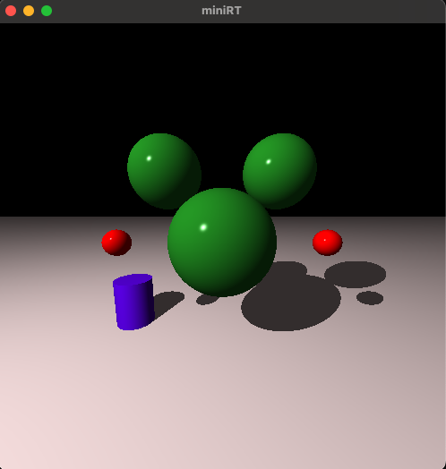

# BeeProject_MiniRt


## Overview
A mini ray tracing project built in C using the MLX42 Library. Through miniRT, we learn the fundamentals and build a basic ray tracer that can render simple 3D scenes with objects such as, plane, cylinder and sphere. This was a group project and I worked on with the amazing and organized Lumi_K(https://github.com/lkilpela).

## Core Features
- Parsing: Ensure the correct file and data are passed through the program, it will exit and return an error message when it parsed an invalid argument.
- Object and Scene: The program will parse ambient 'A', camera 'C', light 'L', sphere 'sp', plane 'pl' and cylinder 'cy'. Each of them will have their characteristics further checked and parsed. 
- Matrix Transformation: Using matrix to calculate translation, scaling and rotation of object and scene.
- Ray Intersection: Ray tracing algorithm is used to determine where the ray strike, shade, and reflective. The algorithm is from The Ray Tracer Challenge.
- Rendering: With all the info parsed and calculated, each pixel will be rendered and display on the screen. 

## Examples
<div align="left">
  <br>
  <figcaption>Sphere with no background</figcaption>
</div>
<div align="left">
  <br>
Multiple object plus spheres to form a Mickey shape with plane as background
</div>

## Testing
You can test the program by git cloning the project and then head into Makefile and find the below codes <br>
```
LIBMLX_LINUX	=	-ldl -lglfw -lm
LIBMLX_OS		=	-L$(LIBMLX_DIR)/build -lmlx42 -lglfw -framework Cocoa -framework OpenGL -framework IOKit
```
Comment out the line that's not your system then scroll down to <br>
```
#MacOS
$(NAME): $(LIBFT) $(LIBMLX) $(OBJECTS)
	@$(CC_FULL) $(OBJECTS) $(LIBFT) $(LIBMLX) $(LIBMLX_OS) $(RPATH_FLAGS) -o $
#Linux
# $(NAME): $(LIBFT) $(LIBMLX) $(OBJECTS)
# 	@$(CC_FULL) $(OBJECTS) $(LIBFT) $(LIBMLX) $(LIBMLX_LINUX) $(RPATH_FLAGS) -o 

```
Make sure the correct one is avaiable then you can <br>
```
make
```
You can call the function by 
```
./minirt scene/basic/sp.rt
```
## Sources:
- The Ray Tracer Challenge (http://raytracerchallenge.com)
